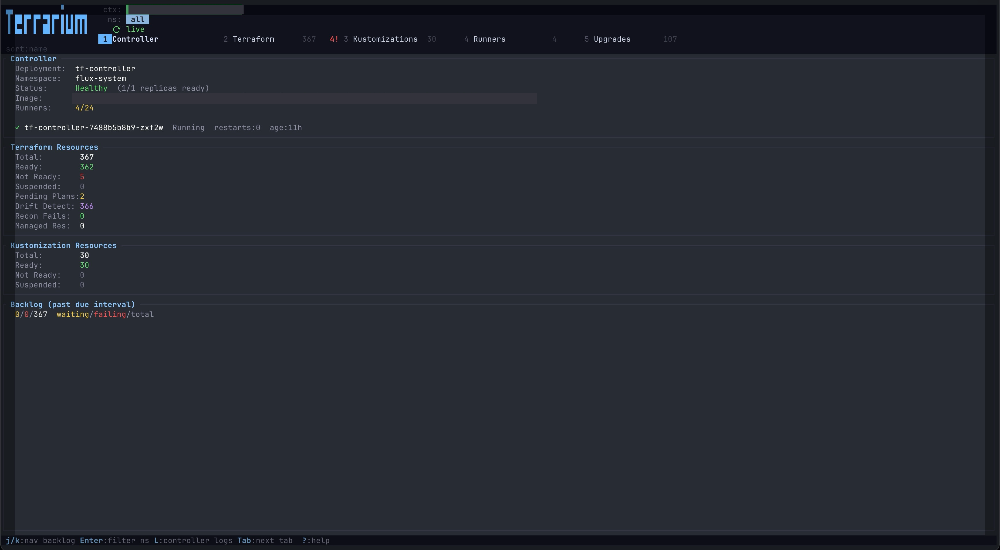
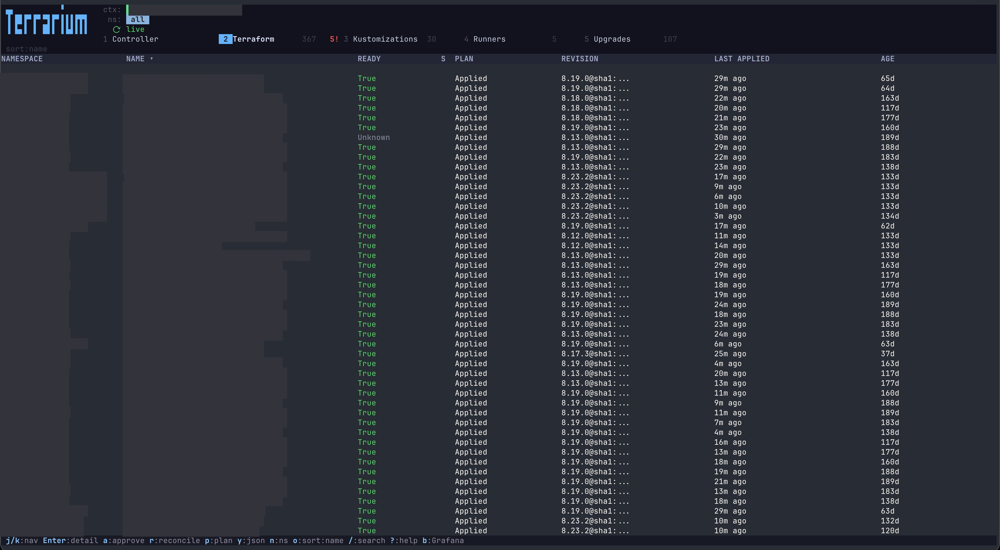
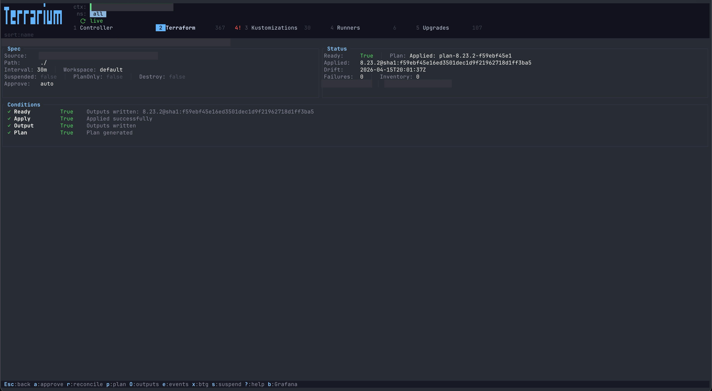
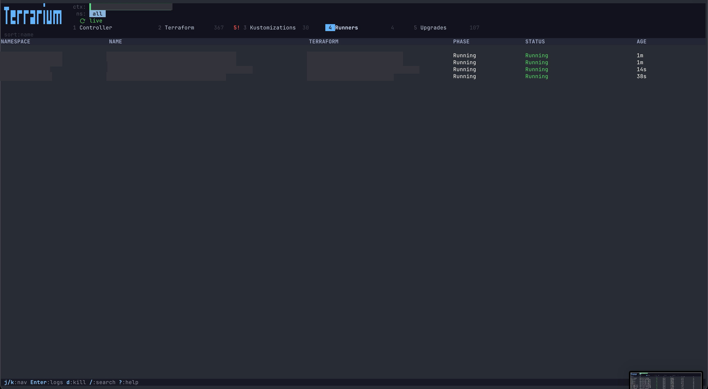

```
 ▄▖          ▘
 ▐ █▌▛▘▛▘▀▌▛▘▌▌▌▛▛▌
 ▐ ▙▖▌ ▌ █▌▌ ▌▙▌▌▌▌
```

A terminal dashboard for managing [tofu-controller](https://github.com/flux-iac/tofu-controller) Terraform and [Flux](https://fluxcd.io/) Kustomization resources in Kubernetes.

## Features

- **Real-time monitoring** of Terraform and Kustomization resources across all namespaces
- **Controller health dashboard** with replica status, runner concurrency, and reconciliation backlog
- **Resource management** — approve plans, reconcile, replan, suspend/resume, force unlock, delete
- **Live runner log streaming** with multi-container switching
- **Content viewers** for plans, outputs, JSON resources, and events with search and line wrap
- **Filtering** — search, namespace picker, failures-only, waiting-only (stale resources)
- **Sorting** by namespace, name, ready status, or age
- **Configurable custom tabs** — filter resources by annotation with custom columns
- **Configurable detail fields** — show extra data from Terraform outputs in the detail view
- **Custom keyboard shortcuts** — open URLs in the browser with template variables
- **Vim-style navigation** throughout — press `?` for the full help screen
- **Mouse support** — optional, toggle with `m` or start with `--mouse`

## Prerequisites

- Access to a Kubernetes cluster with tofu-controller installed
- A valid kubeconfig (`~/.kube/config` or `KUBECONFIG`)

## Installation

### Homebrew (macOS & Linux)

```sh
brew install fenio/tap/terrarium
```

### Download binary

Pre-built binaries for Linux and macOS (amd64/arm64) are available on the
[Releases](https://github.com/fenio/terrarium/releases) page.

### CLI Options

| Flag | Description |
|------|-------------|
| `-n, --namespace <NS>` | Filter to a specific namespace (default: all) |
| `-c, --context <CTX>` | Kubeconfig context to use |
| `--controller-ns <NS>` | Namespace where tofu-controller runs (default: `flux-system`) |
| `--mouse` | Enable mouse support (click, scroll; requires Shift for copy) |

## Keyboard Shortcuts

Press `?` at any time to see the full help overlay. Here's a summary:

### Navigation

| Key | Action |
|-----|--------|
| `j` / `k` / `↑` / `↓` | Move selection up/down |
| `Enter` / `l` | Open detail view / stream logs |
| `Esc` | Go back / clear active filter |
| `Ctrl-d` / `PgDn` | Half page down |
| `Ctrl-u` / `PgUp` | Half page up |
| `g` / `G` | Jump to top / bottom of list |
| `q` | Quit |
| `Ctrl+C` | Quit immediately |

### Tabs

| Key | Action |
|-----|--------|
| `1`-`9` | Jump to tab by number |
| `Tab` / `Shift+Tab` | Next / previous tab |

### Filtering & Search

| Key | Action |
|-----|--------|
| `/` | Search / filter by name or namespace |
| `f` | Toggle failures-only filter (Ready != True) |
| `w` | Toggle waiting-only filter (Ready but past reconciliation interval) |
| `n` | Open namespace picker |
| `o` | Cycle sort column (namespace / name / ready / age) |
| `!` | Jump to first failure in the list |

### Terraform Actions

These work in both the Terraform list and detail views:

| Key | Action |
|-----|--------|
| `a` | Approve a pending plan |
| `r` | Trigger reconciliation |
| `R` | Force a replan |
| `p` | View the Terraform plan |
| `O` | View outputs from the outputs secret |
| `y` | View the full resource as JSON |
| `e` | View Kubernetes events |
| `s` / `u` | Suspend / Resume |
| `F` | Force unlock state (with confirmation) |
| `x` | Break the glass — drop into `tfctl` shell |
| `d` | Delete the resource (with confirmation) |

### Kustomization Actions

| Key | Action |
|-----|--------|
| `r` | Trigger reconciliation |
| `y` | View the full resource as JSON |
| `e` | View Kubernetes events |
| `s` / `u` | Suspend / Resume |

### Runner Actions

| Key | Action |
|-----|--------|
| `Enter` | Stream live logs from the runner pod |
| `d` | Kill the runner pod (with confirmation) |

### Viewer (Plan / Logs / JSON / Events / Outputs)

| Key | Action |
|-----|--------|
| `j` / `k` | Scroll up / down |
| `h` / `l` | Scroll left / right |
| `g` / `G` | Jump to top / bottom (in logs, `G` enables auto-follow) |
| `/` | Search within content |
| `n` / `N` | Jump to next / previous search match |
| `w` | Toggle line wrap |
| `S` | Save content to file (`terrarium_<type>_<timestamp>.txt`) |
| `Tab` | Switch container (log viewer with multiple containers) |

### General

| Key | Action |
|-----|--------|
| `m` | Toggle mouse support on/off |
| `?` | Toggle help overlay |

## Configuration

Terrarium is configurable via a TOML file. It looks for configuration in this order:

1. `TERRARIUM_CONFIG` environment variable (path to config file)
2. `~/.config/terrarium/config.toml`

With no config file, Terrarium shows four built-in tabs (Controller, Terraform,
Kustomizations, Runners) and no extra detail fields. All config sections are optional.

### Detail Fields

Show extra values from the Terraform outputs secret in the detail view Status panel.
When no detail fields are configured, Terrarium lists available output keys to help
you discover what's available.

```toml
[[detail_fields]]
label = "Cluster ID"
source = "cluster_id"        # key in the outputs secret
color = [240, 200, 60]       # RGB color (optional, default: white)
bold = true                  # optional, default: false
```

Fields are displayed two per line in the Status panel. See
[examples/custom-tab.toml](examples/custom-tab.toml) for a working example.

### Custom Tabs

Create additional tabs that filter Terraform resources by annotation and display
custom columns. Useful for tracking deployments, upgrades, team ownership, or any
workflow driven by annotations.

```toml
[[custom_tabs]]
name = "Deployments"
annotation = "scheduled-deployment"   # only show resources with this annotation
expand_json_map = true                # parse annotation value as JSON map
sort_by = "DATE"                      # sort by this column label

[[custom_tabs.columns]]
label = "NAMESPACE"
source = "namespace"
width = 15

[[custom_tabs.columns]]
label = "VERSION"
source = "annotation_key"             # the JSON key when expand_json_map is true
color = [140, 200, 255]
bold = true
width = 20

[[custom_tabs.columns]]
label = "DATE"
source = "annotation_value"           # the JSON value (or raw annotation value)
date_highlight = true                 # color by proximity: red/yellow/green
width = 15
```

**Column sources:**

| Source | Description |
|--------|-------------|
| `namespace` | Resource namespace |
| `name` | Resource name |
| `ready` | Ready condition status (True/False/Unknown), colored automatically |
| `age` | Time since resource creation |
| `annotation_key` | JSON map key (requires `expand_json_map = true`) |
| `annotation_value` | Raw annotation value, or JSON map value if expanded |

See [examples/custom-tab.toml](examples/custom-tab.toml) for complete examples
including a deployment tracker and a team-ownership tab.

### Custom Shortcuts

Define keyboard shortcuts that open URLs in the browser. Useful for linking to
dashboards, log viewers, secret managers, or cloud consoles.

```toml
[[shortcuts]]
key = "b"                    # single character, case-sensitive
label = "Grafana"            # shown in the status bar
url = "https://grafana.example.com/explore?cluster={context}&namespace={namespace}&pod={name}-tf-runner"
```

**Template variables:**

| Variable | Description | Available |
|----------|-------------|-----------|
| `{context}` | Kubeconfig context name | Always |
| `{namespace}` | Resource namespace | Always |
| `{name}` | Resource name | Always |
| `{output.KEY}` | Value from the Terraform outputs secret | Detail view only |

When using `{output.KEY}`, the outputs must be loaded first by opening the detail
view. If outputs aren't cached, Terrarium shows an error flash.

Shortcuts appear in the status bar when viewing Terraform resources. Multiple
shortcuts can be defined with different keys.

See [examples/shortcuts.toml](examples/shortcuts.toml) for examples including
Grafana, Vault, and cloud console links.

## Examples

The [examples/](examples/) directory contains ready-to-use configuration snippets:

| File | Description |
|------|-------------|
| [custom-tab.toml](examples/custom-tab.toml) | Custom tabs with annotation filtering and column definitions |
| [shortcuts.toml](examples/shortcuts.toml) | Browser shortcuts with URL templates |

To use an example, copy the relevant sections into `~/.config/terrarium/config.toml`
or point to it directly:

```sh
TERRARIUM_CONFIG=examples/shortcuts.toml terrarium
```

## Screenshots






## Build from source

Requires Rust 1.88+ (automatically managed via `rust-toolchain.toml`).

```sh
cargo build --release
cp target/release/terrarium /usr/local/bin/
```

## Troubleshooting

If you get errors about unsupported edition or compilation failures, make sure
you're using `rustup`-managed Rust (not Homebrew's `rust` formula). Run `rustup show` —
it should show the toolchain from `rust-toolchain.toml`. If not, remove `rust`
(`brew uninstall rust`) and use `rustup` instead.
