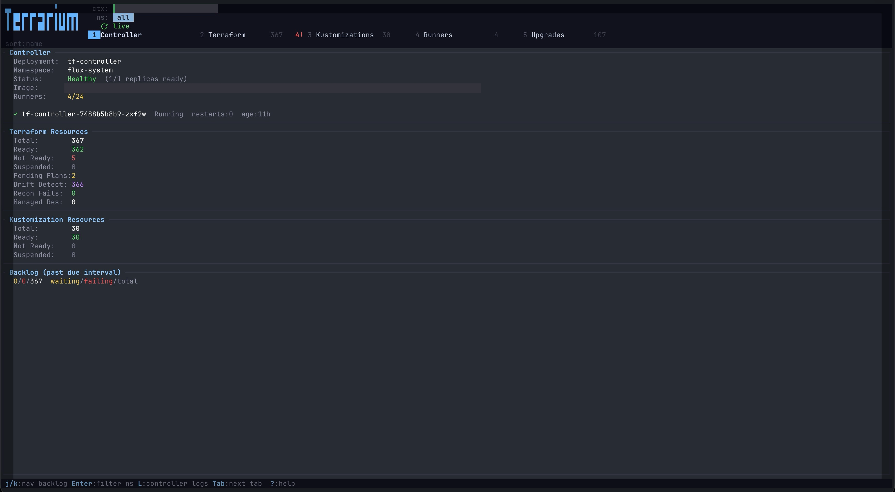
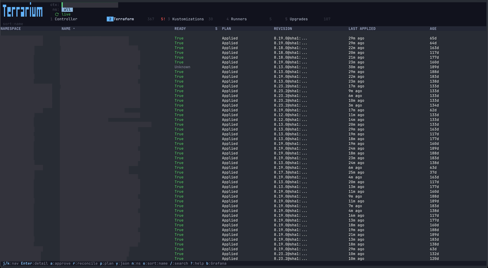
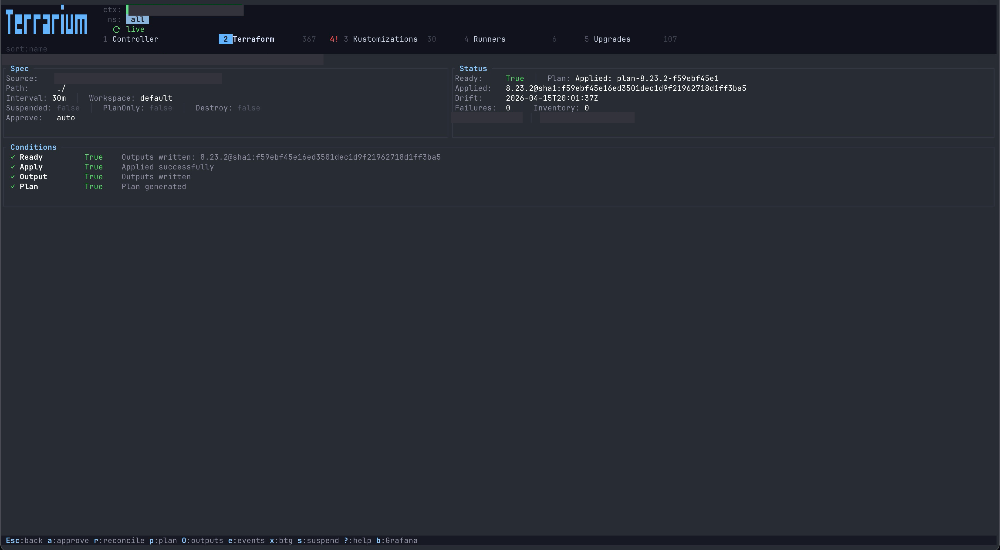
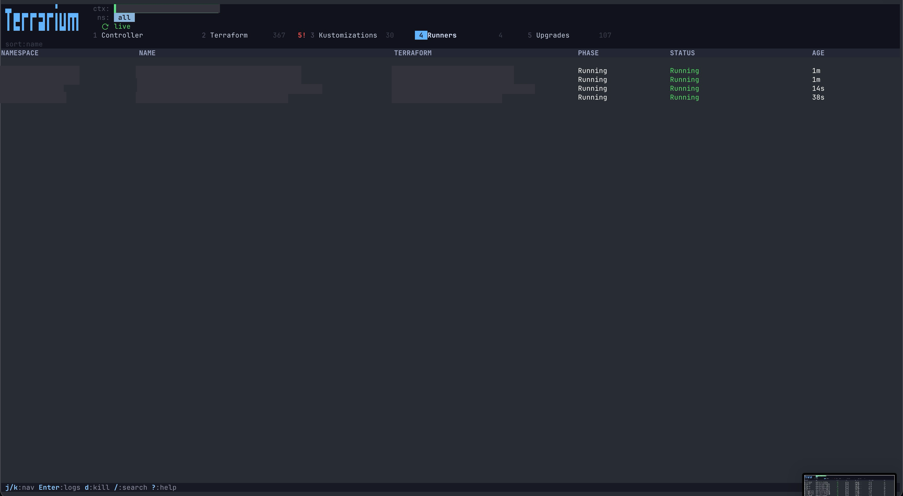

```
 ▄▖          ▘
 ▐ █▌▛▘▛▘▀▌▛▘▌▌▌▛▛▌
 ▐ ▙▖▌ ▌ █▌▌ ▌▙▌▌▌▌
```

A terminal dashboard for managing [tofu-controller](https://github.com/flux-iac/tofu-controller) Terraform and [Flux](https://fluxcd.io/) Kustomization resources in Kubernetes.

## Features

- **Real-time monitoring** of Terraform and Kustomization resources across all namespaces
- **Controller health dashboard** with replica status, runner concurrency, and reconciliation backlog
- **On-demand controller metrics panel** — port-forwards `/metrics` to show reconcile rate, errors, p50/p95/p99 latency, queue depth, and stuck workers
- **Source health visibility** — `GitRepository` source state surfaced inline on TF and KS detail views (✓/✗, short revision, or "not found"/failure reason)
- **Humanized condition errors** — strips tf-controller's RPC framing (`error running Plan: rpc error: code = …`) so terraform's own diagnostic reads cleanly
- **Resource management** — approve plans, reconcile, replan, suspend/resume, force unlock, delete
- **Live runner log streaming** with multi-container switching, preserved across tab switches
- **Per-tab state preservation** — detail views, viewers, and live log streams all survive jumping between tabs
- **Content viewers** for plans, outputs, JSON resources, events, and full conditions with search and line wrap
- **Filtering** — search, namespace picker, failures-only (real failures), progressing-only (in-flight reconciles), waiting-only (stale resources)
- **Sorting** by namespace, name, ready status, revision, last applied, or age — with direction toggle (Runners tab sorts by namespace, name, terraform, phase, or age)
- **Configurable custom tabs** — filter resources by annotation with custom columns
- **Configurable detail fields** — show extra data from Terraform outputs in the detail view
- **Custom keyboard shortcuts** — open URLs in the browser with template variables
- **Vim-style navigation** throughout — press `?` for the full help screen
- **Mouse support** — optional, toggle with `m` or start with `--mouse`

## Prerequisites

- Access to a Kubernetes cluster with tofu-controller installed
- A valid kubeconfig (`~/.kube/config` or `KUBECONFIG`)

## Installation

### Homebrew (macOS & Linux)

```sh
brew install fenio/tap/terrarium
```

### Download binary

Pre-built binaries for Linux and macOS (amd64/arm64) are available on the
[Releases](https://github.com/fenio/terrarium/releases) page.

### CLI Options

| Flag | Description |
|------|-------------|
| `-n, --namespace <NS>` | Filter to a specific namespace (default: all) |
| `-c, --context <CTX>` | Kubeconfig context to use |
| `--controller-ns <NS>` | Namespace where tofu-controller runs (default: `flux-system`) |
| `--mouse` | Enable mouse support (click, scroll; requires Shift for copy) |

## Keyboard Shortcuts

Press `?` at any time to see the full help overlay. Here's a summary:

### Navigation

| Key | Action |
|-----|--------|
| `j` / `k` / `↑` / `↓` | Move selection up/down |
| `Enter` / `l` | Open detail view / stream logs |
| `Esc` | Go back / clear active filter |
| `Ctrl-d` / `PgDn` | Half page down |
| `Ctrl-u` / `PgUp` | Half page up |
| `g` / `G` | Jump to top / bottom of list |
| `q` | Quit |
| `Ctrl+C` | Quit immediately |

### Tabs

Tab navigation works from any view — list, detail, or content viewer — without
having to back out first.

| Key | Action |
|-----|--------|
| `1`-`9` | Jump to tab by number |
| `Tab` / `Shift+Tab` | Next / previous tab |

### Filtering & Search

| Key | Action |
|-----|--------|
| `/` | Search / filter by name or namespace |
| `\` | Pause / resume active filter (keeps the query) |
| `f` | Toggle failures-only filter (real failures — excludes in-flight reconciles) |
| `w` | Toggle waiting-only filter (Ready but past reconciliation interval) |
| `P` | Toggle progressing-only filter (currently reconciling) |
| `D` | Toggle deleting-only filter (resources with a non-empty deletionTimestamp — delete requested but finalizers haven't drained yet; also marked in the leftmost column with `☠`) |
| `n` | Open namespace picker |
| `o` | Cycle sort column (TF/KS: namespace / name / ready / revision / applied / age — Runners: namespace / name / terraform / phase / age) |
| `i` | Invert sort direction (ascending ↔ descending) |
| `!` | Jump to first failure in the list |

### Bulk Operations

Select multiple Terraform or Kustomization resources and apply an
action to all of them at once.

| Key | Action |
|-----|--------|
| `Space` | Toggle selection on the current row (cursor advances) |
| `r` | Reconcile all selected (with confirmation) |
| `s` / `u` | Suspend / resume all selected (with confirmation) |
| `a` | Approve plans for all selected (Terraform only) |
| `Esc` | Clear the selection |

Selected rows are marked with `●` in the leftmost column and a count
appears in the status bar. With an empty selection, `r`/`s`/`u`/`a`
keep their per-row behaviour. Switching tabs clears the selection.

### Controller Tab

| Key | Action |
|-----|--------|
| `Enter` | Filter Terraform list by the selected backlog namespace |
| `L` | Stream logs from the controller pod |
| `M` | Toggle the on-demand metrics panel (port-forwards to controller `/metrics`) |

### Terraform Actions

These work in both the Terraform list and detail views:

| Key | Action |
|-----|--------|
| `a` | Approve a pending plan |
| `r` | Trigger reconciliation |
| `R` | Force a replan |
| `p` | View the Terraform plan |
| `O` | View outputs from the outputs secret |
| `y` / `Y` | View the full resource as JSON / YAML |
| `e` | View Kubernetes events |
| `c` | View full conditions (scrollable, no panel-height clipping) |
| `S` | Open the configured-shortcuts popup (see [Custom Shortcuts](#custom-shortcuts)) |
| `s` / `u` | Suspend / Resume |
| `F` | Force unlock state (with confirmation) |
| `x` | Break the glass — drop into `tfctl` shell |
| `X` | Disable persistent break-the-glass mode (`spec.breakTheGlass: false`, with confirmation) |
| `L` | Stream runner logs |
| `d` | Delete the resource (with confirmation) |

`x` starts the one-time `tfctl break-glass` troubleshooting session. `X` is
the recovery action for persistent break-the-glass mode left enabled on the
Terraform object; it clears `spec.breakTheGlass` without changing any other
spec fields.

### Kustomization Actions

| Key | Action |
|-----|--------|
| `r` | Trigger reconciliation |
| `y` / `Y` | View the full resource as JSON / YAML |
| `e` | View Kubernetes events |
| `c` | View full conditions (scrollable) |
| `s` / `u` | Suspend / Resume |

### Runner Actions

| Key | Action |
|-----|--------|
| `Enter` | Stream live logs from the runner pod |
| `e` | View Kubernetes events |
| `T` | Jump to the associated Terraform detail |
| `d` | Kill the runner pod (with confirmation) |

### Viewer (Plan / Logs / JSON / Events / Outputs / Conditions)

| Key | Action |
|-----|--------|
| `j` / `k` | Scroll up / down |
| `h` / `l` | Scroll left / right |
| `g` / `G` | Jump to top / bottom (in logs, `G` enables auto-follow) |
| `/` | Search within content |
| `n` / `N` | Jump to next / previous search match |
| `w` | Toggle line wrap |
| `S` | Save content to file (`terrarium_<type>_<timestamp>.txt`) |
| `Tab` | Switch container (log viewer with multiple containers) |

### General

| Key | Action |
|-----|--------|
| `Ctrl-x` | Switch kube-context (see [Context Switcher](#context-switcher)) |
| `m` | Toggle mouse support on/off |
| `?` | Toggle help overlay |

## Configuration

Terrarium is configurable via a TOML file. It looks for configuration in this order:

1. `TERRARIUM_CONFIG` environment variable (path to config file)
2. `~/.config/terrarium/config.toml`

With no config file, Terrarium shows four built-in tabs (Controller, Terraform,
Kustomizations, Runners) and no extra detail fields. All config sections are optional.

### Config Sync

When a team shares one `config.toml`, `terrarium sync-config` fetches the latest
copy from a central URL and installs it — so nobody has to manually download and
update the file.

Point it at a `config.toml` served over HTTPS (an internal artifact store, a raw
git URL, etc.):

```toml
[config_sync]
url = "https://internal.example.com/terrarium/config.toml"
```

Then:

```sh
# First run (no local config yet): bootstrap with an explicit URL.
terrarium sync-config https://internal.example.com/terrarium/config.toml

# Afterwards: refresh from the [config_sync] url baked into your config.
terrarium sync-config
```

How it works:

- fetches with `curl`, so it transparently uses your proxy, VPN, `.netrc`, and
  any SSO/mTLS your environment already provides;
- **validates** the download parses as a Terrarium config *before* touching disk,
  and writes atomically — a failed sync never leaves a broken config;
- backs up the previous file to `config.toml.bak`;
- writes to `$TERRARIUM_CONFIG` if set, otherwise `~/.config/terrarium/config.toml`.

> **Security:** a synced config can define `[switcher] builder`, which runs a
> shell command. Only sync from a URL you trust. Plaintext `http://` is refused;
> use `https://` (or a local `file://` path).

### Detail Fields

Show extra values from the Terraform outputs secret in the detail view Status panel.
When no detail fields are configured, Terrarium lists available output keys to help
you discover what's available.

```toml
[[detail_fields]]
label = "Cluster ID"
source = "cluster_id"        # key in the outputs secret
color = [240, 200, 60]       # RGB color (optional, default: white)
bold = true                  # optional, default: false
```

Fields are displayed two per line in the Status panel. See
[examples/custom-tab.toml](examples/custom-tab.toml) for a working example.

### Custom Tabs

Create additional tabs that filter Terraform resources by annotation and display
custom columns. Useful for tracking deployments, upgrades, team ownership, or any
workflow driven by annotations.

```toml
[[custom_tabs]]
name = "Deployments"
annotation = "scheduled-deployment"   # only show resources with this annotation
expand_json_map = true                # parse annotation value as JSON map
sort_by = "DATE"                      # sort by this column label

[[custom_tabs.columns]]
label = "NAMESPACE"
source = "namespace"
width = 15

[[custom_tabs.columns]]
label = "VERSION"
source = "annotation_key"             # the JSON key when expand_json_map is true
color = [140, 200, 255]
bold = true
width = 20

[[custom_tabs.columns]]
label = "DATE"
source = "annotation_value"           # the JSON value (or raw annotation value)
date_highlight = true                 # color by proximity: red/yellow/green
width = 15
```

**Column sources:**

| Source | Description |
|--------|-------------|
| `namespace` | Resource namespace |
| `name` | Resource name |
| `ready` | Ready condition status (True/False/Unknown), colored automatically |
| `age` | Time since resource creation |
| `annotation_key` | JSON map key (requires `expand_json_map = true`) |
| `annotation_value` | Raw annotation value, or JSON map value if expanded |

See [examples/custom-tab.toml](examples/custom-tab.toml) for complete examples
including a deployment tracker and a team-ownership tab.

### Custom Shortcuts

Define keyboard shortcuts that open URLs in the browser. Useful for linking to
dashboards, log viewers, secret managers, or cloud consoles.

```toml
[[shortcuts]]
key = "b"                              # single character, case-sensitive
label = "Grafana"                      # short label shown in the popup
description = "logs from Loki"         # optional; shown next to the label
url = "https://grafana.example.com/explore?cluster={context}&namespace={namespace}&pod={name}-tf-runner"
```

The `description` is optional but recommended when you have shortcuts with the
same `label` (e.g. multiple GitLab links pointing to different parts of the
repo). It's the main text shown in the popup so users can pick the right one
without reading URLs.

An optional `group = "..."` field organizes the popup into sections — useful
when you have many shortcuts:

```toml
[[shortcuts]]
key = "b"
label = "Logs"
group = "Observability"
description = "logs in Grafana"
url = "..."

[[shortcuts]]
key = "A"
label = "Argo Infra"
group = "ArgoCD"
description = "apps search on this cluster's infra ArgoCD"
url = "..."
```

Consecutive shortcuts sharing a group render under one section header in the
popup. Shortcuts without a group render at the top in an unnamed first section.

**Template variables:**

| Variable | Description |
|----------|-------------|
| `{context}` | Kubeconfig context name |
| `{namespace}` | Resource namespace |
| `{name}` | Resource name |
| `{var.KEY}` | Value from a matching `[[context_vars]]` entry (see [Context-aware shortcuts](#context-aware-shortcuts)) |
| `{output.KEY}` | Value from the Terraform outputs secret |
| `{output.KEY.subkey...}` | Nested JSON path into a JSON-valued output |
| `{secret.NAME.KEY}` | Value from any other Secret in the resource's namespace |
| `{label.KEY}` | Value from `metadata.labels[KEY]` on the Terraform resource |
| `{annotation.KEY}` | Value from `metadata.annotations[KEY]` on the Terraform resource |

For `{output.KEY}`, `KEY` is a top-level entry in the secret written via the
controller's `spec.writeOutputsToSecret`. If the value is itself a JSON object,
you can drill in with dot-separated paths — e.g. `{output.metadata.region}`
parses the `metadata` value as JSON and reads its `region` field. Missing keys
substitute as empty strings.

Shortcuts that use `{output.…}` lazily fetch the outputs secret when first
pressed, so they work from the list view without opening the detail view first.

`{secret.NAME.KEY}` reads from any Secret named `NAME` in the resource's
namespace — useful when a per-cluster URL or identifier lives in an input
Secret (e.g. tofu-controller's `varsFrom` secret) rather than the outputs
Secret. Like `{output.…}`, the secret is fetched lazily on first use and
cached for subsequent activations. Missing secrets and missing keys
substitute as empty strings.

`{label.KEY}` and `{annotation.KEY}` read directly from the Terraform
resource's `metadata.labels[KEY]` / `metadata.annotations[KEY]`. No
extra fetch — the values come from the in-memory watcher store. Label
keys with dots and slashes work as-is, so
`{label.kustomize.toolkit.fluxcd.io/name}` resolves correctly.
Missing labels/annotations substitute as empty strings.

**Activating a shortcut:**

- Press the configured `key` directly to open the URL — the keybind from
  `key = "b"` opens that shortcut from any TF list, custom tab, or TF detail
  view.
- Or press `S` to open a popup listing every configured shortcut with the
  resolved URL alongside it. Navigate with `j/k`, press `Enter` to open the
  highlighted entry, or press the entry's own key for direct activation.
  `Esc` closes the popup.

Submenu shortcuts (nesting one shortcut under another via a `children` array
of further `[[shortcuts]]`) are accepted by the config parser but the popup
doesn't drill into them yet — that's planned for a later release.

**Conditional shortcuts (`when`):**

Multiple shortcuts can share the same `key`. When the key is pressed,
terrarium picks the first entry whose `when` filter matches the
selected resource. Entries without a `when` always match. The
Shortcuts popup hides entries that don't apply to the open resource.

```toml
# GitOps tree for clusters (most resources)
[[shortcuts]]
key = "g"
label = "GitOps tree"
when = { name = "^cluster-" }
url = "https://git.example.com/repo/-/tree/main/clusters/{name}"

# Same key, different repo path for GTM automation resources
[[shortcuts]]
key = "g"
label = "GitOps tree"
when = { name = "^gtm-automation-" }
url = "https://git.example.com/repo/-/tree/main/gtm/{name}"

# Fallback that matches anything (no `when`); listed last so the more
# specific entries above win when applicable.
[[shortcuts]]
key = "g"
label = "GitOps tree (fallback)"
url = "https://git.example.com/repo/-/tree/main/other/{name}"
```

`when.name`, `when.namespace`, and `when.context` are Rust regex
strings (the [`regex` crate](https://docs.rs/regex)); use anchors
`^`/`$` for prefix/exact matches. All three fields are optional; when
multiple are present, they're combined with AND. `when.context` matches
against the active kubeconfig context name — handy for routing the same
key to different URLs in QA vs prod environments. Invalid regexes are
skipped with a stderr warning at startup rather than crashing.

### Context-aware shortcuts

When the same logical shortcut (Grafana, Vault, ArgoCD, …) lives on a
different host depending on which kube context is active, you can
either:

1. **Duplicate the shortcut with `when.context`** — works, but tedious if
   you have many environments or many shortcuts that need swapping.
2. **Define `[[context_vars]]` and reference `{var.KEY}` in the URL** —
   one shortcut, environment-aware host. Recommended for the common
   "just the host changes" case.

```toml
# Narrow override sits above a broad catch-all. Per key, the first
# matching entry that defines that key wins; the catch-all fills in
# any keys the override doesn't set.
[[context_vars]]
match = "devcloud"
vars  = { grafana_host = "grafana-mom-shared-ord.cloud-observability.akadns.net",
          linode_host  = "admin.devcloud.linode.com" }

[[context_vars]]
match = ".*"
vars  = { grafana_host = "grafana-mom-prod-lax.cloud-observability.akadns.net",
          linode_host  = "admin.linode.com" }

# Single shortcut for Grafana — the host swaps automatically based on
# whichever kube context you're pointed at when you press `b`.
[[shortcuts]]
key = "b"
label = "Grafana"
url = "https://{var.grafana_host}/d/terraform?var-cluster={name}"
```

`match` is a Rust regex against the active kube context name. Missing
`{var.KEY}` lookups substitute as empty and log a `tracing::warn!`
once per `(context, key)` so a misconfigured table is visible in
`$RUST_LOG` output without spamming on every activation.

See [examples/shortcuts.toml](examples/shortcuts.toml) for examples including
Grafana, Vault, and cloud console links.

### Context Switcher

Press `Ctrl-x` at any time to open the context switcher and reconnect the whole
app to another kube-context — no restart. All watchers, pollers, and caches are
torn down and re-established against the new cluster.

By default the switcher lists the contexts of the kubeconfig Terrarium started
with (`$KUBECONFIG` or `~/.kube/config`). To source the switchable contexts from
somewhere else, set a `builder`:

```toml
[switcher]
builder = "your-tool print-merged-kubeconfig"
```

The `builder`:

- runs **once at startup** via `sh -c`, so it must invoke a real binary — not a
  shell function or alias;
- must print a **merged kubeconfig YAML on stdout** and nothing else (send any
  progress or logging to stderr);
- is optional — a missing or failing builder is non-fatal; Terrarium falls back
  to the on-disk kubeconfig and shows a flash message.

**Interactive auth (OIDC / exec plugins).** If a context authenticates via a
client-go `exec` credential plugin (`kubectl oidc-login`, `aws eks get-token`,
`gke-gcloud-auth-plugin`, Azure, …), Terrarium pre-authenticates it on the
normal terminal — at startup before the TUI opens, and again by briefly
suspending the TUI on a `Ctrl-x` switch — so any browser login or prompt appears
on a clean screen instead of garbling the interface. This is provider-agnostic:
Terrarium only runs whatever the kubeconfig declares. Token- and
certificate-based contexts need no pre-flight and switch instantly.

## Controller Metrics Panel

Press `M` on the Controller tab to enable the metrics panel. Terrarium opens a
native port-forward (no `kubectl` required) to a controller pod, fetches
`/metrics` every 5 seconds, and displays:

| Metric | Notes |
|--------|-------|
| Reconciles/min | Rate, derived from `controller_runtime_reconcile_total` |
| Errors/min | Rate of `result="error"` reconciles |
| p50 / p95 / p99 reconcile time | Estimated from `gotk_reconcile_duration_seconds` histogram. Shows `>30m` if the quantile lands in the `+Inf` bucket. |
| API errors/min | Rate of non-2xx responses to the Kubernetes API |
| Tracked resources | Unique resources tf-controller has reconciled at least once (may differ from total CR count if a resource has never been reconciled) |
| Active workers | In-process reconcile goroutines currently running |
| Queue depth (p0 / p-100) | Workqueue backlog by priority — p0 is event-driven, p-100 is periodic resync |
| Longest running | Duration of the longest currently-running reconcile (a high value here points to a stuck `terraform apply`) |

The panel is fully optional — when disabled (default), no port-forward is
opened. Press `M` again to disable.

## Examples

The [examples/](examples/) directory contains ready-to-use configuration snippets:

| File | Description |
|------|-------------|
| [custom-tab.toml](examples/custom-tab.toml) | Custom tabs with annotation filtering and column definitions |
| [shortcuts.toml](examples/shortcuts.toml) | Browser shortcuts with URL templates |

To use an example, copy the relevant sections into `~/.config/terrarium/config.toml`
or point to it directly:

```sh
TERRARIUM_CONFIG=examples/shortcuts.toml terrarium
```

## Screenshots






## Build from source

Requires Rust 1.88+ (automatically managed via `rust-toolchain.toml`).

```sh
cargo build --release
cp target/release/terrarium /usr/local/bin/
```

## Troubleshooting

If you get errors about unsupported edition or compilation failures, make sure
you're using `rustup`-managed Rust (not Homebrew's `rust` formula). Run `rustup show` —
it should show the toolchain from `rust-toolchain.toml`. If not, remove `rust`
(`brew uninstall rust`) and use `rustup` instead.
